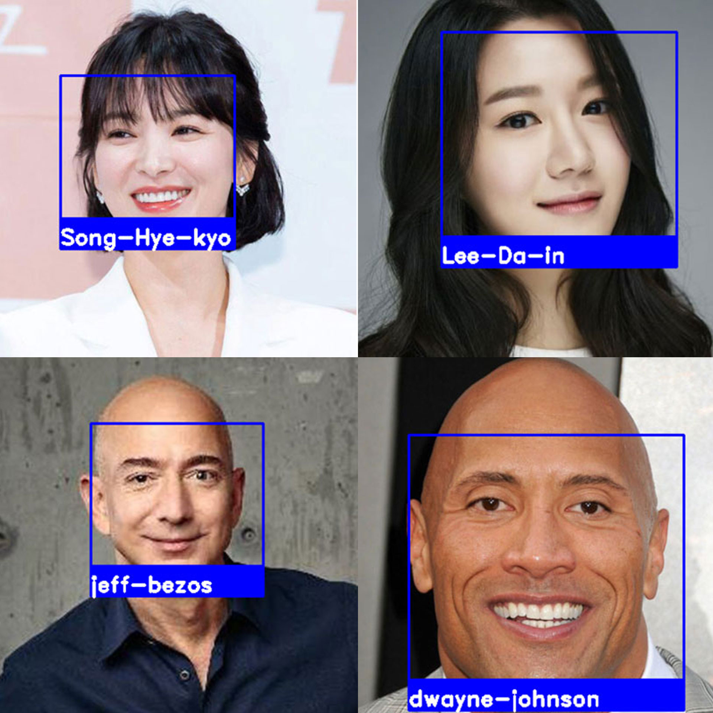
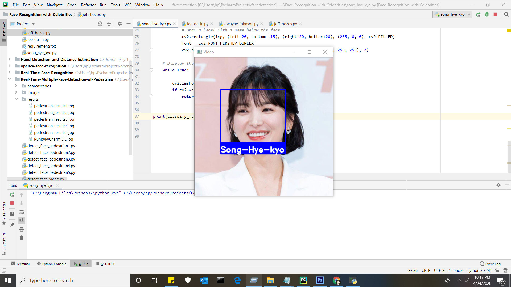

# Face Recognition with Celebrities
Face Recognition Celebrity Faces Identification using face_recognition Library in Python. 

## Real Time Face Detection with Celebrities.

<table>
  <tbody>
	<tr align="center"> 
		<th><strong>Real Time Face Recognition with Celebrities GUI</strong></th>
	</tr>
	<tr align="center">
		<td></td>		
	</tr>
</tbody>
</table>

# Face Recognition

Recognize and manipulate faces from Python or from the command line with
the world’s simplest face recognition library.

Built using dlib’s state-of-the-art face recognition
built with deep learning. The model has an accuracy of 99.38% on the
Labeled Faces in the Wild benchmark.

This also provides a simple face_recognition command line tool that lets
you do face recognition on a folder of images from the command line!

## Requirement
<ul>
<li>Python 3.7</li>
<li>OpenCV 4.2.0</li>
<li>face_recognition</li>
<li>dlib</li>
<li>cmake</li>
<li>numpy==1.15.4</li>
</ul>

## Dependencies
<ul>
<li>opencv</li>
<li>numpy</li>
</li>face_recognition</li>
</ul>

## Install dependencies

<code>pip install opencv-python</code>

<code>pip install numpy</code>

<code>pip install face-recognition</code>

## How to use?
<ol>
  <li>Clone the repository</li>
  
<code>git clone https://github.com/muhammadshiraz/Face-Recognition-with-Celebrities.git</code>

</ol>
<ol start="2">
  <li>Move to the directory</li>
  
<code>cd Face-Recognition-with-Celebrities</code>

</ol>
<ol start="3">
  <li>To view the Song Hye-kyo Face Recognition</li>
  
<code>python song_hye_kyo.py</code>

</ol>
<ol start="4">
  <li>To view the Lee Da-in Face Recognition</li>
  
<code>python lee_da_in.py</code>

</ol>
<ol start="5">
  <li>To view the Jeff Bezos Face Recognition</li>
  
<code>python jeff_bezos.py</code>

</ol>
<ol start="6">
  <li>To view the Dwayne Johnson Face Recognition</li>
  
<code>python dwayne_johnson.py</code>

</ol>

## Run by PyCharm IDE:
 
#### Real Time Face Recognition with Celebrities

